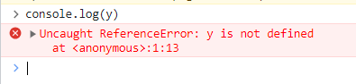
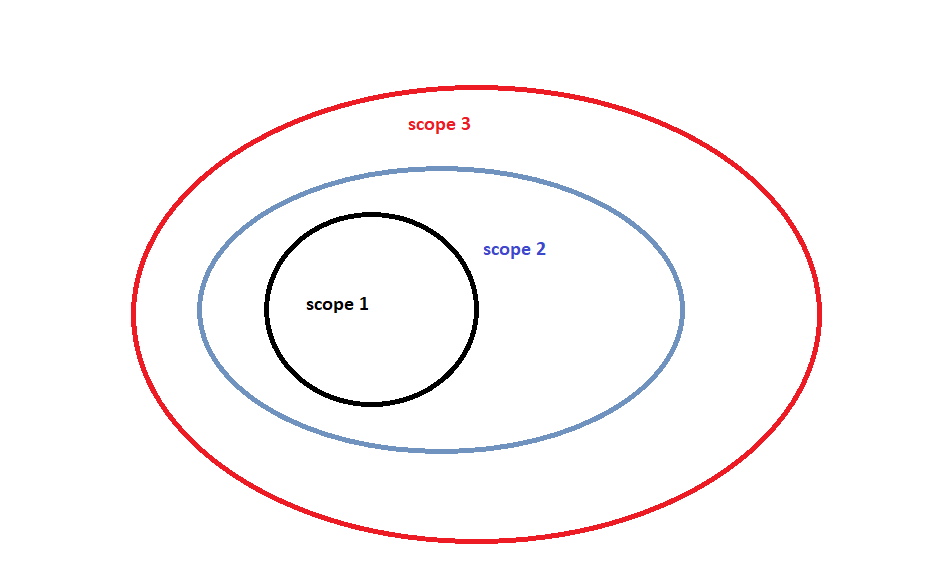

# javascript_suallar
Javascript proqramlama dili Brendan Eich tərəfindən Netscape şirkəti üçün 1995-ci ildə (js mənlə yaşıddır:) yaradılıb.

# sual-1 ---- Javascript nədir ? 
# cavab-1 ----

***Compilation - yüksək səviyyəli proqram dili ilə yazılmış (high-level programming language ) kodların kompüter tərəfindən başa düşülə bilən maşın-kodlarına və ya byte-kodlarına çevirilməsi prosesidir. 
***Compiler- Yüksək səviyyəli kodlarla yazılan kodları proqram işləməmişdən qabaq maşın-kodlarına çevirir.
***interpreter - Yüksək səviyyəli kodlarla yazılan kodları proqram işləyərkən sətir-sətir (line-by-line) maşın-kodlarına çevirir.

Compilerlər daha sürətlidir , İnterpreterlərlə kod üzərində dəyişiklik etdikdə bütün proqramı yenidən compile etməyə gərək olmur.

Javascript mühərrikləri compiler və interpreterlərin ən yaxşı xüsusiyyətlərini götürüb və JİT(just-in-time) compilation model yaradıblar. Buna görə Javascript nədir sualına cavab olaraq aşağıdakı ifadəni deyə bilərik: 

-Javascript  lightweight (yaddaşda az yer tutan, minimalistik xüsusiyyət və sintaksı olan, asan icra olunan), interpreter və ya JİT(Just-in-time) compiler proqramlama dilidir.

# sual-2 ---- Java və Javascript arasında olan fərq nədir ?  
# cavab-2 ---- 
Javascript - client-side skriptləmə dilidir. Bəzən Javascriptə brauzer dili də deyilir. Çünki Javascriptlə interaktiv səhifələr yaza bilərik.
Java - obyekt yönümlü proqramlama dilidir və özünün virtual maşın platformu var.Bu virtual maşın platformu demək olar ki, bütün platformalarda işləyə bilən compile olunmuş proqramlar yarada bilir.

# sual-3 ---- Javascript data tipləri hansılardır ?
# cavab-3 ---- 
Javascriptdə data tipləri 3 yerə bölünür primitiv (primitive), trivial(bilmədim necə tərcümə edim ki, düzgün olsun :) və mürəkkəb (composite).

primitive:
 -number
 -string
 -boolean
 -symbol 

trivial
 -undefined
 -null

composite
 -object
 -function
 -array

# sual-4 ---- isNaN funksiyasını nə zaman istifadə edərdin? 
# cavab-4 ----

isNaN funksiyası daxil edilən dəyərin rəqəm olub-olmadığını müəyyən edir. Müqayisə apararkən ilk öncə dəyəri rəqəm tipinə çevirir. Nəticə olaraq boolean qaytarır.

isNaN ilə Number.isNaN funksiyaları bir-birindən fərqlənir. 
Belə ki, isNaN daxil edilən dəyəri rəqəmə çevirir və alınan nəticənin NaN olub-olmadığını yoxlayır.
Number.isNaN funksiyasında true cavabı almaq üçün daxil edilən dəyər number tip olmalıdır və eyni zamanda NaN olmalıdır.

NaN - not a number. 

# sual-5 ---- undeclared və undefined dəyişənləri haqqında.
# cavab-5 ----

Undefined - bu (error deyim) error əsasən dəyişən təyin olunub amma heç bir dəyər mənimsədilmədiyi zaman yaranır. Undefined keyword deyil. 

Undeclared - bu error biz yaradılmamış və ya təyin edilməmiş dəyişəni istifadə etmək istəyəndə yaranır. Undeclared dəyişəninin tipi undefined-dir. Global dəyişəndir.

# sual-6 ---- Javascriptdə hoisting nədir ?
# cavab-6 ---- 

Bildiyimiz kimi,  javascriptdə dəyişəni istifadə etmək üçün birinci ona dəyər verməsək belə təyin etməliyik yəni ilk öncə dəyişəni yaratmalıyıq. 
Hoisting funksiya və dəyişəni təyin etməmişdən öncə istifadə edib daha sonra təyin etməyimizə kömək edir.
Məs: 
1) 
x=3; 
console.log(x);  // nəticə olaraq 3  alacağıq.
var x;

Bu o deməkdir ki, dəyişən və funksiya təyin olunma (variable and function declaration) harada təyin olunmasından asılı olmayaraq scop-un (local və global scope) əvvəlinə keçir. 

Hoisting haqqında oxuyanda düşündüm ki, nəyə görə let və const-la misallar göstərilməyib və let/const-la hoisting varmı deyə biraz araşdırdım. Let və const-la təyin edilmiş dəyişənlərdə də hoisting  baş verir amma bu var-dan fərqlənir. 

var-la təyin edilmiş dəyişənlərdə hoisting default dəyərlə (undefined) birlikdə baş verir (hoisted with a default initialization of undefined).
let və const-da isə yalnız dəyişənin təyin edilməsi başa düşülür amma dəyəri olmur (hoisted without a default initialization). Dəyəri olmadığına görə error alırıq (aşağıda misalda göstərdim).

Məsələn baxın: 

console.log(x) ; //  cavab: undefined 

var x= 10 ;  

console.log(x) ; // cavab 10 

-----------------------------------------------------------------------------------------------------------------------

console.log(y);

// ReferenceError: Cannot access 'y' before initialization

let y = 10

// və ya const y =10 ;

console.log(y);

ikinci misala baxsaq görərik ki, dəyəri olmayan dəyişənə müdaxilə etmək mümkün deyil error-u göstərir. Əgər js y dəyişənini tanımasaydı  
"is not defined" erroru verərdi.

let/const dəyişənlərinin hoisted olub amma müdaxile edilə bilməməsi prosesinə "Temporal Dead Zone" deyilir. (y ilə olan misal)

# sual-7 ---- Javascript statik dildir, yoxsa dinamik dildir?
# cavab-7 ----

Dinamik dillərdə dəyişənin tipi run-time (kod işləyəndə) yoxlanılır, statik dillərdə isə dəyişənin tipi compile olunduqda yoxlanılır.Javascript dinamik dildir. Yəni biz kodlarda

x=5; 

yazdıqdan sonra , 

x= "hello qardash"; 

yaza bilirik. Fikir verdizsə x-in tipi ilk öncə number sonra string olaraq dəyişdi.
 
# sual-8 ----  primitive və non-primitive  data tiplər arasında olan fərq nədir ? 
# cavab-8 ---- 

Misalla baslayaq , deməli biz 

let x=5;

yazdıqda x dəyişənini təyin edib ona dəyər mənimsətdik. Arxa planda isə "=" assign operatoru yaddaşda 2 dəyərini saxlamaq üçün bir yer ayırır və x dəyişəni birbaşa həmin yeri göstərir.

let y = x ; 

yazdıqda "=" operatoru yenə yaddaşda yeni bir yer tutur ora 2 dəyərini yazır və y yaddaşdakı yerin ünvanını göstərir.Yəni x başqa ünvanı, y başqa unvanı göstərir.

let obyekt =  {
    "name" : "Vusala" , 
    "surname": "Safarova" , 
}

let obyektIkinci = obyekt ; 

bu misalda isə obyekt yarandıqda yaddaşda bir yer tutur və yaddaşdakı yerin ümvanını göstərir. Burada "=" operatoru obyektIkinci-yə birbaşa obyekt-in yaddaşdakı yerinin ünvanını ötürür. Başqa sözlə yazsam, obyekt-in referansını obyektİkinciyə ötürürür.

# sual-9 ----  Immediately Invoked Function (IIFE). (dərhal icra olunan funksiyalar)
# cavab-9 ----

İİFE funksiyalar təyin olunan kimi icra edilən funksiyalardır. Sintaksisi aşağıdakı kimidir. Başqa proqramlama dillərində bu funksiyalara anonim funksiyalar da deyildiyini bilirəm. 

(function(){

    // kodlarını yaz icra etsin

    
})();

# sual 10 ---- HOF: Higher Order Functions 
# cavab-10 ----

Qısaca desək funksiya return edən funksiyalardır. 

function higherOrder2() {

  return function() {

  
    return "kodlarını yaz icra etsin";

    
  }

  
}      

var x = higherOrder2();

x()   // nəticə "kodlarını yaz icra etsin"

# sual 11 ---- Scope nədir ?
# cavab-11 ----
Javascriptdə scope kodun müxtəlif hissələrində dəyişənlərin və funksiyaların əlçatanlığını müəyyən edir.

Js-də 3 tip scope var :

- Global Scope
- Local və ya Function Scope
- Block Scope

Global scope - Global scope-da təyin edilmiş dəyişən və funksiyalara kodun istənilən yerindən girişimiz olur. Yəni istənilən yerdə funksiyanı çağırıb işlədə bilərik və ya dəyişənləri istifadə edə bilərik. 

Function Scope - Funksiyanın içində təyin edilən funksiya və ya dəyişənlərdir. Əgər biz hər hansı bir dəyişəni funksiyanın içində təyin etmişiksə , funksiyanın çölündə həmin dəyişəni istifadə edə bilməyəcəyik. 

məsələn :

function bizimFunk () {
  var a = 5 ; 

  function insideFunction () {
    return a+5 ; 
  }

}

console.log(a);  /referance error 
insideFunction(); /referance error 

Block Scope: Block scope ancaq let və const-la təyin edilmiş dəyişənlərdə olur. var ilə təyin edilmiş dəyişənlərin block skopu olmur. Block scope {} bloklar arasında təyin edilmiş dəyişənlərdir və həmin blokların çölündə dəyişənləri istifadə etmək olmur. 

Scope Chain ( Scope zənciri :)

Javascript dəyişənləri tapmaq üçün scop-lardan istifadə edir. 
Məsələn: 
Şəkildə əgər scope -1 -də bir dəyişəndən istifadə etmişik amma həmin dəyişən scope-1-də təyin edilməyib. Onda javascript bir üst scope-da həmin dəyişəni axtarır , tapmasa scope-3-un icine kecir və həmin dəyişəni scope3-də axtarır və ən sonda global scop-u axtarır, tapsa istifadə edir tapmasa error. 

# javascript_suallar
### to be continued :) 
